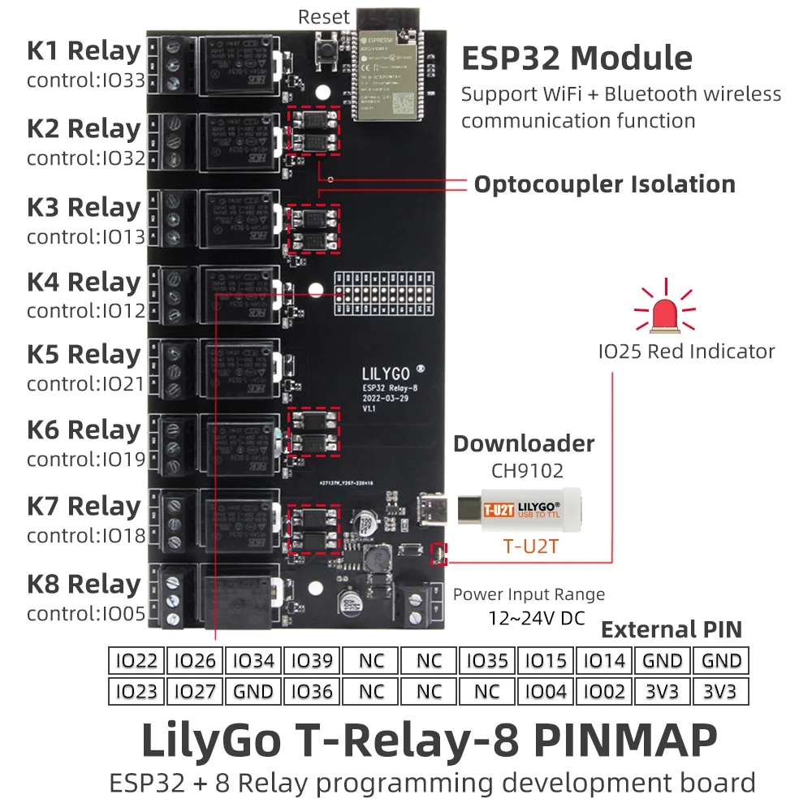
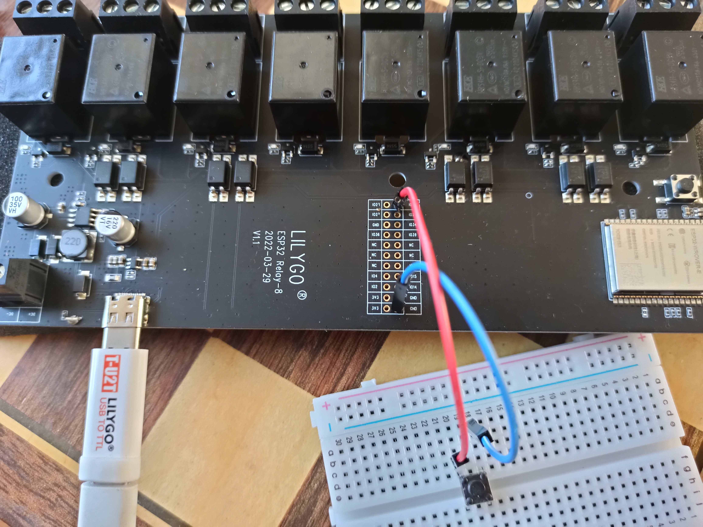
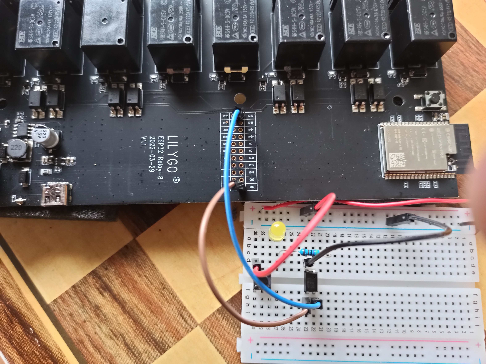
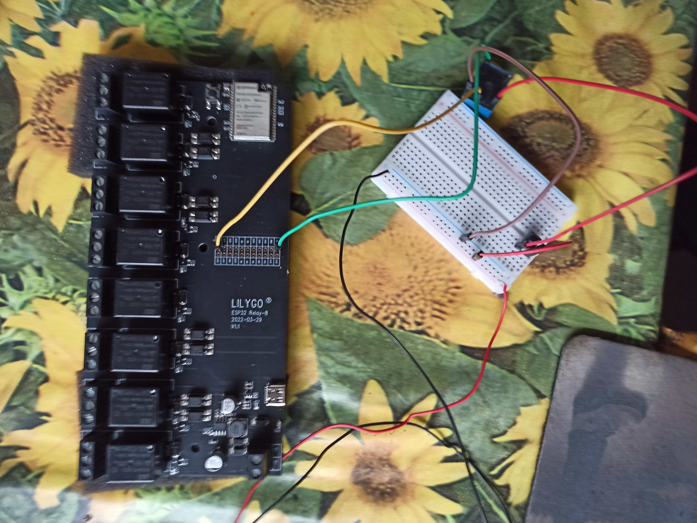

**Verkeerslichten**

De installatie is gemaakt met de [[https://nl.aliexpress.com/item/1005004335642099.html]{.underline}] en

Dit is een bordje met 8 relais met een esp32-wrover-e MCU (micro controller unit)

We gebruiken de relais K1 t/m K5. Een GPIO is input/output pin van de esp32.  
K1 = rood verkeerslicht. Verbonden met GPIO33  
K2 = oranje verkeerslicht. Verbonden met GPIO32  
K3 = groen verkeerslicht. Verbonden met GPIO13  
K4 = rood oversteeklicht. Verbonden met GPIO12  
K5 = groen oversteeklicht. Verbonden met GPIO21  

K1, K2 ... zijn aansluitingen waarop steeds 2 verkeerslichten zijn aangesloten. De twee verkeerslichten doe precies het zelfde. Ook de oversteeklichten zijn dubbel uitgevoerd.

Voor de drukknop gebruiken we een input pin van de esp32. Meer hierover later.

Alle relais worden aan de rechterkant van de relais (op de tekening) bestuurd door de esp32. De besturing van de esp32 zet de uitgang van de relais (aan de linkerkant) van het relais aan of uit. De uitgang van een relais staat elektrisch gezien los van de ingang. Op de uitgang kan een 230V belasting aangesloten worden. In dit geval worden de lampen op de relais aangesloten.

**Het programmeren van de relais.**
De esp32 is programmeerbaar. Normaal gesproken worden esp32 op een bord verkocht. Bijvoorbeeld op een development bord. Veel, DRUKKNOPPEN\_GPIOmaar vaker niet alle pinnen van de esp32 worden dan op het bordje voorzien van aansluitingen. De volgorde van de pinnen op de esp32 kan ook anders zijn dan de volgorde van het development bordje. Dit hier ook het geval. Een aantal pinnen van de esp32 zijn direct verbonden aan de relais. Maar de overblijvende pinnen kun je nog steeds benaderen. Die aansluitingen zijn aan de rechthoek met 2 rijen gaatjes. Dat zijn dan de external pins uit de image. Beginnend bij IO22 (= GPIO22), IO26.... GND en de andere rij pin IO23 t/m 3V3.

Voor het kijken of een knop ingedrukt is, gebruiken we 2 externe pinnen GND en xxxx (zie verder drukknoppen)

Het programmeren gaat via de usb-c aansluiting. Bij de meeste developmentbordjes kun je rechtstreek met usb-c programmeren, maar in dit bordje ontbreekt een IC om usb-c om te zetten naar de TTL niveau's die de esp32 verwacht. Daarvoor hebben we een speciale usb stick T-U2T gekocht. Aan de ene kant past die op het bord. Aan de andere kant kun je een usb-verloopkabel stoppen (usb-c) en aan de computerkant een ouderwetse dikke usb aansluiting. Dit werkt in ieder geval in Ubuntu zonder drivers (maar niet in Ubuntu in een Virtualbox).

Ik heb gekozen voor C++ als taal. PlatformIO kan C++ compileren naar machinetaal voor de esp32. PlatformIO is een extensie voor Python. VSCode (Visual Studio Code) heeft een speciale plugin voor platformIO. Hierdoor is het mogelijk om in VSCode alle voordelen van een C++ compiler te gebruiken. Het voordeel van een C++ compiler is dat je veel betere checks en foutmeldingen hebt dan in UI's als de Arduino IDE.

Met deze plugin kun je de binary uploaden, kun je allerlei boards kiezen enz.

**Installeren software**

Dit is wat getest heb in Ubuntu 22.04

- Installeer eerst vscode
- Installeer de plugin platformIO
- Maak een project met platformIO (noem het Verkeerslichten)
- Haal alles binnen van het repository [Github verkeerslichten](https://github.com/KeesBleijenberg/Verkeerslichten)

  Je kunt de source op 2 manieren binnen halen:
  1. Via git in vscode
     Dan wordt het project automatisch goed ingesteld. Je maakt dus het project door de source van github te dowloaden.
  2. Je download de source als een zip bestand. Maakt een nieuw leeg project en kopieer dan de code uit de zip over de code van het lege project.

Maar let op: Als je een leeg project maakt staat daar in de map src het bestand main.c   
Dit is een c bestand en geen cpp bestand. Waarom?
Als je de source over het lege bestand kopieert, heb je main.c en main.cpp. Bij het builden gebruikt platformIO dan main.c (dus niet de cpp versie). Dat wil je niet. Verwijder daarom main.c en eventueel ook platformIO.ini voordat je de inhoud van de zip over het lege project kopieert.

**Waarom C++ in plaats van C**   
Ik gebruik C++ voor de code, maar er is eigenlijk weinig verschil met C. De verschillen:
- In plaats van de moeizame C strings (array's of chars) gebruik ik de C++ strings. Dat doe ik door \<string\> te include in plaats van de C library \<string.h\>.
- voor schrijven naar standard out' gebruik ik de C++ functie cout.
- In C++ kun je één functie verschillend aantal en andere soorten parameters geven. Je hebt dan dus de functie met dezelfde naam verschillende keren definiëren.      Dat gebeurt door de code voor deze functies te hernoemen naar allerlei cryptische namen. Dus achter de schermen krijgt elke functie variant een aparte naam. Dat proces heet name mangling. Dit name-mangling kan een probleem zijn als de linker op zoek gaat naar de functie main. Die is dan ook name mangling ondergaan. Om dat te voorkomen zeg je:
  extern C main() {....}
  Hierdoor heeft de functie nog steeds de originele naam. Dat vindt de linker fijn, maar je kunt daardoor niet meer varianten hebben voor de functie main.  
  In de code wordt main name mangling alleen toegepast voor de functie main.
  Eigenlijk heb ik name mangling nergens nodig, omdat ik nergens meer varianten van functies met dezelfde naam gebruik.

**Monitoren van het programma**   
Als je in de software ergens zet cout \<\< "blahblah" betekent dit bij normale c++ programma's: schrijf blahblah naar standard out (meestal het beeldscherm). Bij de plugin is standard out de com-poort naar de serial monitor. In de platformIO plugin in VsCode kun je de output bekijken door in de blauwe balk onderin te kiezen voor het icoontje dat er uit ziet als een kleine stekker me de tekst platformIO: serial monitor als je er overheen gaat met de muis.
Soms zie je in de seriele monitor alleen maar garbage. Dan is de baud-rate niet goed. Die kun je wijzigen in platformIO.ini Bv: monitor\_speed = 115200   

**Uploaden code**  
- Builden doe je door in VSCode onderin de blauwe balk met het witte font, te kiezen voor het icoon 'PlatformIO build'. Het ziet er uit als een wit vinkje
  Builden lukt soms niet omdat VSCode iets niet herkent als nieuwe code. Kies dan voor clean in de blauwe balk (icoontje vuilnisbak)
- Upload doe je door in VSCode onderin de blauwe balk met het witte font, te kiezen voor het icoon 'PlatformIO upload'. Het ziet er uit als een witte pijl   
  Als het uploaden niet lukt, helpt het soms als je het bordje reset. Er zit daarvoor een drukknopje tussen de processor en de relais.   
- Als het programma geupload is, begint het programma meteen te draaien. Je kunt het programma dus niet vooraf of achteraf stoppen.
  
**Aansluiten bordje**  
Het inputvoltage voor het hele bord is tussen 12 tot 24 volt.   
Het bordje werkt ook met alleen usb als voeding.   
Bij elk relais zit een blauwe led. Je kunt dus zien of een relais wel of niet bekrachtigd wordt. De relais maken ook flink wat geluid.   
Het uploaden van de binary naar het bordje is ingewikkelder dan bij de meeste andere bordjes. Dat komt omdat er geen usb naar com (serieel) chip op het bordje zit. Daarvoor hebben we de download CH1902 gekocht. Op het plaatje zie je hem rechtsonder. Ubuntu herkende de stick probleemloos en daar ging het uploaden direct goed.   
Onder Windows schijn je een driver te moeten installeren. Dat is me in mijn oude Windows 7 niet gelukt.   

**Detecteren indrukken knop in de software**
Er zijn 2 drukknoppen, elk verkeerslicht één. ADRUKKNOPPEN\_GPIOls op één van deze drukknoppen gedrukt wordt, moet de functie handleGedrukt() uit main.cpp gestart worden. Voor de software is het niet van belang op welke knop gedrukt wordt. Belangrijk is dát er 'n knop wordt ingedrukt. De twee drukknoppen moeten daarom in parallel op de input van de esp32 aangesloten zijn.  
Voor het uitlezen van de drukknoppen gebruik ik GPIO 22.   
Veel poorten worden gebruikt voor de relais. De overblijvende poorten zitten in 2 rijen (gaatjes) op het bordje. Port GPIO-22 zit in de de rij die het dichts bij de processor zit en dan in die rij het dichts bij de relais. Op de hoek dus.   
Ground zit ook in dezelfde rij, maar dan helemaal aan de andere kant.   
De maximale stroom voor elke pin van de esp32 is 40mA.  
De esp32 werkt met 3.3Volt. Dus niet met 5 Volt voor de Arduino. Je kunt een Arduino dus niet blindelings vervangen door een esp32. Er staan wat artikelen op het internet waarin beweerd wordt dat een esp32 toch geschikt is voor 5 Volt.  

**Test door drukknop op poort**  
Als eerste test heb ik de schakelaar gesimuleerd met een gewone drukknop. Met de test wilde ik kijken of als ik drukte, het bordje dit op zou merken de procedure knopgedrukt() zou starten.   

Het rode draadje zit op het bordje in GPIO-22 en de blauwe draad zit aan ground.   
Het programma stelt GPIO-22 tijdens de setup() van de hardware in op het gebruik van een interne pull up weerstand. Tussen de inwendige poort en de uitwendige poort zit dan een weerstand, waardoor poort 22 verbonden is met 3.3Volt. Deze weerstand zit in de esp32.   
Als je op de knop (vlak onder de rode draad) drukt, wordt poort GPIO-22 verbonden met ground (=0). Dus als je op de knop drukt leest het programma op poort GPIO-22 een 0 en als je niet drukt leest het programma een 1. Dus verkeerd om. In software vertaal ik 0 als volgt naar een boolean: 0 → true, 1 → false.   

**Test met een optocoupler**
Bij de volgende test heb ik de drukknop vervangen door een optocoupler.  
In de uiteindelijke versie is er geen pushbutton die GPIO-22 met ground kan verbinden. Het idee is om gebruik te maken van een optocoupler. De ingang van de optocoupler wordt aangestuurd door de drukknoppen of de verkeerslichten. De uitgang van de optcoupler stuurt het bordje aan. Door de optocoupler heb je een electrische scheiding tussen de drukknoppen van de verkeerslichten en het bordje. Hierdoor kunnen we bij de drukknoppen met 12 Volt werken. De stroom die door de verkeersknoppen mag lopen is nu alleen begrend door wat de optocoupler bij de ingang aan kan.   
Ik heb een PC817 optocoupler gekozen.   
Hieronder staat een testschakeling. Links op de horizontale gleuf zit een pushbutton die staat voor de drukknoppen op de verkeerslichten. Rechts op de gleuf zit optcoupler PC817.
   
- De inputkant van de optocoupler (aansluitingen bovenkant PC817) staat los van de outputkant van de optocoupler (onderkant van de PC817). De outputkant positieve pin van de outputkant is verbonden met GPIO-22 (blauwe draad). De negatieve pin van de outputkant van de optocoupler is verbonden met ground van het bordje (bruine draad).
  Het circuit voor de inputkant wordt in de test gevoed door een 5Volt adapter. De horizontale rij met de rode + is dus 5V. De horizontale tweede rij met de blauwe -- er voor is de ground voor het inputcircuit.
  De + gaat naar de pushbutton, dan naar de gele led, dan naar de 4.7KOhm weerstand, dan naar de positieve kant van de input van de PC817 (rechtsboven, er zit hier een ronde markering) en dan van de negatieve kant van de input (links boven) van de PC817. Als je op de knop drukt gaat er een stroom van ongeveer 1 mA (5V / 4.7KOhm) door het inputcircuit lopen.
- Bij de verkeerslichten is er geen adapter en willen 12V gebruiken. De stroom door het inputcircuit wordt dan 2 a 3 mA.
- De datasheet voor de optocoupler kun hier [https://www.alldatasheet.com/datasheet-pdf/pdf/43371/SHARP/PC817.html) downloaden.
  **Samenvatting datasheet PC817 **   
  De ronde markering op de pc817 staat bij de plus van de input (1 in de datasheet). De min van de input zit aan dezelfde korte kant (2). Diagonaal van de markering (3) zit de min van de output. De overblijvende is de plus van de output (4).   
  In het inputcircuit mag maximaal 50 mA lopen.
  Maximaal vermogen dat er opgewekt mag worden is 70 mWatt.   
  Ik heb geen idee wat de power consumption is aan de output kant. Maar ik vermoed dat dit heel weinig is.

Deze schakeling blijkt te werken. Het programma herkent het als je op de knop drukt.   
Wat me zorgen baarde was dat de optocoupler geen directe verbinding levert tussen de poort en ground, maar een geleidende transistor. Daarom probeerde ik bij deze schakeling te meten hoeveel volt er tussen de poort ground kwam te staan. Vreemd genoeg bleed het voltag heel langzaam op te lopen en nog vreemder was dat door het meten het programma dacht dat ik op de knop gedrukt had. Achteraf gezien denk ik dat de voltmeter heel kort de poort heel even belast, waardoor het voltage zakt en de poort heel even 0 wordt.   
Maar ik vertrouwde het niet en we besloten om het met een relais te proberen.

**Test met een relais**   
In deze test heb ik de optocoupler door een relais. Het blauwe blokje met de zwarte onderkant naast het witte experimenteerbordje.
   
- Het relais is eigenlijk niet zo geschikt.
- Het relais past niet op het experimenteerbordje (de pinnen passen niet)
- Het relais is ontworpen voor grote stromen (10A). Dat is voor het aansturen van de port niet nodig.
- Het relais is ontworpen voor 5V. De spoel voor de schakelaar heeft een weerstand die zo groot is dat je er direct (zonder een weerstand) 5V op aan kunt sluiten. Voor deze test gebruik ik als voeding een oude 5V adapter: de zwarte en rode draden die midden onderin uit beeld lopen. Als je op de pushbutton (helemaal rechts op het witte bordje) drukt, komt er 5V op de inputkant van het relais te staan. Je hoort een klik en de output kant van het relais wordt 'open' gezet. Dus de gele draad en de groene draad worden met elkaar verbonden. Dit blijkt te werken.
- Voor het echte werk moeten we een ander relais gebruiken. Bijvoorbeeld een 12V relais.   
We hebben besloten om de zaak conform deze test te gaan doen.

**Software**  
Het programma is geschreven in c++. Maar in dit geval is het verschil met C maar klein.
Bij embedded systemen is er vrijwel altijd sprake van een functie setup om poorten en variabelen te initialiseren. Daarn gaat het programma in een eindeloze lus. Het programma heeft dus geen echt einde, maar loopt altijd door.
Het programma main in main.cpp begint met setup om de poorten te initialiseren. Dat wil zeggen welke poorten voor input en welke voor output zijn. GPIO\_NUM\_22
Na de setup begint de eindeloze lus (while(true){....})
Als in test.h de regel
\#define TEST\_GEDRUKT is weggecommentarieerd door er // voor te zetten, werkt het programma normaal. Dan kijkt het programma in deze lus of er een knop ingedrukt is en zo ja start hij de functie handleGedrukt.  
Ik heb de software zo simpel mogelijk gehouden.  
Dus geen threads.  
Zo min mogelijk memory allocation in de heap met bijbehorende potentiële problemen.  
Geen exceptions.
Het is me niet helemaal duidelijk welke compiler platformIO gebruikt. Ik vermoed G++ (gcc).
De linker lijkt me LD (geen gold?).

**De tijd sleepSecs()**  
Het bordje weet niks over tijd of datum. Er is geen internet om de tijd op te halen of te synchroniseren. Daarvoor in de plaats is er een soor timer. Dat is een getal, dat bij het opstarten op 0 wordt gezet. Daarna wordt dit getal na elke xxx tijdinterval opgehoogd. Probleem is dat dit getal na een paar dagen (heb ik ergens gelezen) omklapt. Dus van een heel groot getal wordt het getal opeens weer 0. Dat kan problemen geven als het getal omklapt als je net een paar seconden wacht. Wat ik nog aan wil doen:
- Uitzoeken of de tijdfuncties die ik nu gebruik (zijn specifiek voor dit bordje), rekening houden met dit omklappen van dit getal.
- Over gaan op c++ tijd (met name \<chrono\>).
  Volgens wat ik begrepen heb, draait het programma nooit langer dan een dag. Daardoor is er geen probleem met omklappen van de tijd. De volgende keer start de processor weer op en de 'tijd' staat weer op 0.
- De led lampen in de stoplichten blijken traag te zijn. Vooral bij het AAN gaan duurt het even voor de lamp ook echt brand. Ik heb hier in de software rekening mee gehouden. Dus zetEenLampAan() zet de lamp aan en wacht vervolgens heel even voordat het programma verder loopt. Er is dus een tijd om te wachten tot de lamp echt brandt. Ook kun je een tijd instellen waarin je even wacht op het uitdoven van het licht.

**Debouncen van de drukknop**  
De esp32 controleert vele malen per seconde of er gedrukt is. Probleem is dat het lijkt alsof een schakelaar in één keer aan of uit gaat. Maar in het werkelijkheid ziet de esp32 op het moment dat je drukt heel even dat de schakelaar binnen een korte tijd heel vaak aan en weer uit gaat. Dat is in vaak lastig. Oplossingen om dit probleem te voorkomen heten debouncen.
Debouncen kan met hardware, maar ook met software. Bij softwarematig debouncen kijk je bijvoorbeeld naar de stand van de schakelaar en zeg een tiende seconde later kijk je opnieuw. Pas als de standen gelijk zijn, neem je aan dat er gedrukt is.
Bij het verkeerslicht is dit allemaal niet nodig. De esp32 ziet bijvoorbeeld dat er gedrukt is en begint aan handleGedrukt(). Wat er vlak daarna met de schakelaar gebeurt (bijvoorbeeld snel weer uit en weer aan), negeert de esp32. Het debouncen is niet nodig omdat de esp32 alleen geïnteresseerd is óf er überhaupt gedrukt is.
De drukknop zet een relais in werking. Het probleem zou alleen kunnen zijn dat door het indrukken het relais een paar keer aan en weer uit gaat. Dat is voor de software geen probleem, maar het relais zou onnodig kunnen slijten.
Als dit een probleem is: misschien is het beter om voor het relais een schakeling te maken die aan gaat en dan 1 seconde aan blijft ook al laat je de schakelaar los (flip flop of latch).

**Normally open en normally closed (relais)**
Er zijn verschillende soorten relais. Wat relais onderscheidt is wat ze doen als er geen spanning op de ingang staat. Je hebt relais waarbij de uitgang dan geen contact (doorverbinding) maakt en je hebt relais waarbij de uitgang wel doorverbonden wordt.
De eerste heten 'Normally open' en de tweede 'Normally closed'. Voor échte verkeerslichten is het belangrijk dat als er geen spanningop de ingang staat (bijvoorbeeld door draadbreuk naar de drukknoppen) dat het oversteeklicht op rood staat en het verkeerslicht op groen. Voor het rode oversteeklicht zou je dan een normally closed relais moeten maken.
Bij het bordje kun je per relais kiezen of je ze normally closed of normally open wil gebruiken. Je hebt daarvoor bij de uitgang van elk relais 3 aansluitingen:
nc: normally closed gebruik
no: normally open gebruik
com: ground (klopt dit?)
De software gaat ervan uit dat alle relais normally open zijn. Wil je daarom alle relais via nc en com aansluiten (althans dat is wat ik begrepen heb).

Misschien kunnen we dit later aanpassen. Dit is vooral ook van belang als je meer stoplichten zou hebben die met elkaar samenwerken. Denk aan een kruispunt waarbij stoplichten voor beide richtingen op groen zouden kunnen staan. Maar dat is misschien meer voor later.

**Debuggen**  
Er zijn speciale debug libraries. Die heb ik niet gebruikt. Je kunt met cout \<\< "de waarde van mijn variable: " \<\< mijn\_variable \<\< endl; de waarde van een bepaalde variabelen tonen in de seriële monitor. Dit is een soort "poor men debugging". Maar het is wel erg weinig werk.

**Kapot relais**   
Het relais voor het groene oversteeklicht krijgt het meest voor de kiezen. Dit is het relais dat het groen oversteeklicht moet laten knipperen. Ik vermoed dat dit relais daarom het eerst kapot gaat. Als dit relais kapot gaat, kun je een ander relais nemen.
Neem als vervangend relais in dit voorbeeld het onderste relais. Dit zou je dan kunnen doen:
- Verander in hardwareVerkeerslichten.h de waarde van DRUKKNOPPEN\_GPIO naar DRUKKNOPPEN\_GPIO = GPIO\_NUM\_05;
- Sluit de draden voor het groene verkeerslichten aan op het onderste relais.
- Build en upload het programma naar het bordje en het groene oversteeklicht zou weer moeten werken.

**De bekabeling naar de verkeerslichten??**
- voeding
  - ventilator in voeding
- het verkeerslicht
- zekeringen
  - in de voeding
  - structuur (iedere paar lampen 1 zekering)
  - grootte